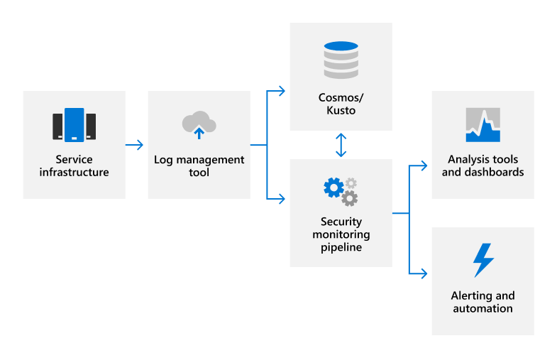

# Audit logging overview

## How does Microsoft 365 employ audit logging?

Microsoft 365 employs audit logging to detect unauthorized activities in its products and services and provide accountability for Microsoft personnel. Audit logs capture details about system configuration changes and access events, with details to identify who was responsible for the activity, when and where the activity took place, and what the outcome of the activity was. Automated log analysis supports near real-time detection of suspicious behavior. Potential incidents are escalated to the Microsoft 365 Security Response team for further investigation.

Microsoft 365 internal audit logging captures log data from various sources, such as:

- Event logs
- AppLocker logs
- Performance data
- System Center data
- Call detail records
- Quality of experience data
- IIS Web Server logs
- SQL Server logs
- Syslog data
- Security audit logs

## How does Microsoft 365 centralize and report on audit logs?

Many different types of log data are uploaded from Microsoft 365 servers to a proprietary security monitoring solution for near real-time (NRT) analysis and an internal big data computing service (Cosmos) for long-term storage. This data transfer occurs over a FIPS 140-2-validated TLS connection on approved ports and protocols using a proprietary automation tool called the Office Data Loader (ODL).

Logs are processed in NRT using rule-based, statistical, and machine learning methods to detect system performance indicators and potential security events. Machine learning models use incoming log data and historical log data stored in Cosmos to continuously improve detection capabilities. Security-related detections generate alerts, notifying on-call engineers of a potential incident and triggering automated remediation actions when applicable. In addition to automated security monitoring, service teams use analysis tools and dashboards for data correlation, interactive queries, and data analytics. These reports are used to monitor and improve the overall performance of the service.

For more information on security monitoring and alerting, see the [Security monitoring overview](assurance-security-monitoring.md).

## How does Microsoft 365 protect audit logs?

The tools used in Microsoft 365 to collect and process audit records do not allow permanent or irreversible changes to the original audit record content or time ordering. Access to Microsoft 365 data stored in Cosmos is restricted to authorized personnel. In addition, Microsoft 365 restricts the management of audit logs to a limited subset of Security team members responsible for audit functionality. The Security Team does not have standing administrative access to Cosmos. Administrative access requires Just-In-Time (JIT) access approval, and all changes to logging mechanisms for Cosmos are recorded and audited. Audit logs are retained long enough to support incident investigations and meet regulatory requirements. The exact period of audit log data retention in Cosmos is determined by the service teams; most audit log data is retained for 90 days or longer.

## How does Microsoft 365 protect end-user identifiable information that may be captured in audit logs?

Prior to uploading log data, the ODL application uses a scrubbing service to remove any fields that contain customer data, such as tenant information and end-user identifiable information, and replace those fields with a hash value. The anonymized and hashed logs are rewritten and then uploaded into Cosmos. All log transfers occur over a TLS encrypted connection (FIPS 140-2).

## Related external regulations & certifications

Microsoft's online services are regularly audited for compliance with external regulations and certifications. Refer to the following table for validation of controls related to audit logging.

| **External audits** | **Section** | **Latest report date** |
|:--------------------|:------------|:-----------------------|
| [FedRAMP (Office 365)](https://compliance.microsoft.com/compliancemanager) | AU-2: Audit events   AU-3: Content of audit records   AU-4: Audit storage capacity   AU-5: Response to audit processing failures   AU-6: Audit review, analysis, and reporting   AU-7: Audit reduction and report generation   AU-8: Time stamps   AU-9: Protection of audit information    AU-10: Non-repudiation   AU-11: Audit record retention   AU-12: Audit generation  | September 24, 2020 | 
| [ISO 27001/27002 (Office 365)](https://servicetrust.microsoft.com/ViewPage/MSComplianceGuideV3?command=Download&downloadType=Document&downloadId=8d625374-4f2d-49f8-9d37-a4281ba98222&tab=7027ead0-3d6b-11e9-b9e1-290b1eb4cdeb&docTab=7027ead0-3d6b-11e9-b9e1-290b1eb4cdeb_ISO_Reports)    [Statement of Applicability](https://servicetrust.microsoft.com/ViewPage/MSComplianceGuideV3?command=Download&downloadType=Document&downloadId=c0df4ce8-c77e-4183-84eb-c8688470d8b1&tab=7027ead0-3d6b-11e9-b9e1-290b1eb4cdeb&docTab=7027ead0-3d6b-11e9-b9e1-290b1eb4cdeb_ISO_Reports)   [Certification](https://servicetrust.microsoft.com/ViewPage/MSComplianceGuideV3?command=Download&downloadType=Document&downloadId=1e84a14a-2468-45ac-9412-5e53250d57ec&tab=7027ead0-3d6b-11e9-b9e1-290b1eb4cdeb&docTab=7027ead0-3d6b-11e9-b9e1-290b1eb4cdeb_ISO_Reports) | A.12.4: Logging and monitoring | February 22, 2020 |
| [ISO 27017 (Office 365)](https://servicetrust.microsoft.com/ViewPage/MSComplianceGuideV3?command=Download&downloadType=Document&downloadId=8d625374-4f2d-49f8-9d37-a4281ba98222&tab=7027ead0-3d6b-11e9-b9e1-290b1eb4cdeb&docTab=7027ead0-3d6b-11e9-b9e1-290b1eb4cdeb_ISO_Reports)    [Statement of Applicability](https://servicetrust.microsoft.com/ViewPage/MSComplianceGuideV3?command=Download&downloadType=Document&downloadId=c0df4ce8-c77e-4183-84eb-c8688470d8b1&tab=7027ead0-3d6b-11e9-b9e1-290b1eb4cdeb&docTab=7027ead0-3d6b-11e9-b9e1-290b1eb4cdeb_ISO_Reports)   [Certification](https://servicetrust.microsoft.com/ViewPage/MSComplianceGuideV3?command=Download&downloadType=Document&downloadId=70de0999-5451-43a3-9ef4-761e8fbfb1a3&tab=7027ead0-3d6b-11e9-b9e1-290b1eb4cdeb&docTab=7027ead0-3d6b-11e9-b9e1-290b1eb4cdeb_ISO_Reports) | A.12.4: Logging and monitoring | February 22, 2020 |
| [SOC 1 (Office 365)](https://servicetrust.microsoft.com/ViewPage/MSComplianceGuideV3?command=Download&downloadType=Document&downloadId=90df3f9c-3aaf-4dbf-99d0-ca9f2991721b&tab=7027ead0-3d6b-11e9-b9e1-290b1eb4cdeb&docTab=7027ead0-3d6b-11e9-b9e1-290b1eb4cdeb_SOC_%2F_SSAE_16_Reports) | CA-48: Datacenter logging   CA-60: Audit logging | December 24, 2020 |
| [SOC 2 (Office 365)](https://servicetrust.microsoft.com/ViewPage/MSComplianceGuideV3?command=Download&downloadType=Document&downloadId=a73c1738-7892-42b7-acd3-87b6371c53f6&tab=7027ead0-3d6b-11e9-b9e1-290b1eb4cdeb&docTab=7027ead0-3d6b-11e9-b9e1-290b1eb4cdeb_SOC_%2F_SSAE_16_Reports) | CA-48: Datacenter logging   CA-60: Audit logging | December 24, 2020|