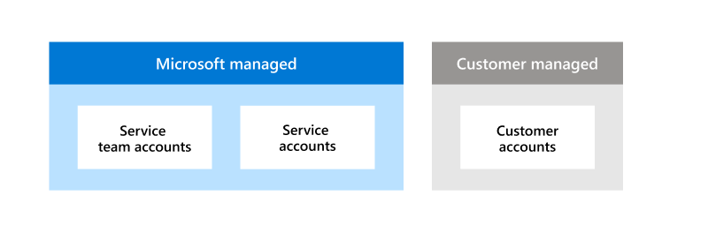

# Account management in Microsoft 365

Microsoft has invested heavily in systems and controls that automate most Microsoft 365 operations while intentionally limiting the need for direct access to servers and customer data by service personnel. Humans govern the service and software operates the service. This structure enables Microsoft to manage Microsoft 365 at scale and minimizes the risks of both internal and external threats. Microsoft approaches access control with the assumption that everyone is a potential threat to Microsoft 365 services and customer data. For this reason, the Zero Standing Access (ZSA) principle lays the foundation for the entire access control structure used by Microsoft 365.

By default, Microsoft personnel have zero standing privileged access to any Microsoft 365 environment or customer data for an organization. It is only through a robust system of checks and approvals that service team personnel can gain privileged access with a narrow action and time scope. Through this system, Microsoft can significantly reduce the potential of Microsoft 365 service personnel and attackers from gaining unauthorized access or causing malicious or accidental harm to Microsoft services and customers.

## Account Types

Microsoft 365 meets all organizational missions and business functions using three categories of accounts: service team accounts, service accounts, and customer accounts. Managing these accounts is a shared responsibility between Microsoft and customers. Microsoft manages both service team and service accounts, which are used to operate and support Microsoft products and services. Customer accounts are managed by the customer and allow them to tailor account access to meet their internal access control requirements.

## Microsoft-managed accounts

**Service team accounts** are used by Microsoft 365 service team personnel developing and maintaining Microsoft 365 services. These accounts do not have standing privileged access to Microsoft 365 services, instead they can be used to request temporary and limited privileged access to perform a specified job function. Not every service team account can perform the same actions, separation of duties is enforced using role-based access control (RBAC). Roles ensure that service team members and their accounts have only the minimum access required to perform specific job duties. Additionally, service team accounts cannot belong to multiple roles where they can act as the approver for their own actions.

**Service accounts** are used by Microsoft 365 services to authenticate when communicating with other services through automated processes. Just as service team accounts are only given the minimum access necessary to perform the specific personnel’s job duties, service accounts are only granted the bare minimum access needed for their intended purpose. Additionally, there are multiple types of service accounts that are designed to fulfill a specific need. One Microsoft 365 service may have multiple service accounts, each with a different role to perform.

## Customer-managed accounts

**Customer accounts** are used to access Microsoft 365 service and are the only accounts each customer is responsible for. It is the customer's duty to provision and manage the accounts in their organization to maintain a secure environment. Management of customer accounts is done through Azure Active Directory (AAD) or federated with on-premises Active Directory (AD). Each customer has a unique set of access control requirements they must meet, and customer accounts grant each customer the ability to satisfy their individual needs. Customer accounts cannot access any data outside of their customer tenant.

## Service team account management

Microsoft 365 manages service team accounts throughout their lifecycle using an account management system called Identity Management (IDM). IDM uses a combination of automated verification processes and managerial approval to enforce the security requirements related to service team account access.

Service team members do not automatically get a service team account, they must first meet eligibility requirements and get approval from an authorized manager. To be eligible for a service team account, service team personnel must first go through [pre-employment personnel screening](assurance-pre-employment-screening.md), a [cloud background check](assurance-cloud-background-check.md), and complete all standard and required role-based training. Once all eligibility requirements have been met, a request for a service team account can be made and must be approved by an authorized manager.

IDM is also responsible for tracking the periodic rescreening and training needed to maintain a service team account. The Microsoft cloud background check must be completed every two years and all training material must be reviewed annually. If either of these requirements are not satisfied by the expiration date, their eligibility is revoked and the service team account is automatically disabled.

Additionally, service team account eligibility is automatically updated by [personnel transfer and termination](assurance-employee-transfer-termination.md). Changes made in the Human Resources Information System (HRIS) trigger IDM to take action, which varies depending on the situation. Personnel transferring to another service team will have an expiration date set for their eligibilities and a request to maintain eligibilities must be submitted by the service team member and approved by their new manager. Terminated personnel automatically have all eligibilities revoked and their service team account is disabled on their last day. An urgent request for account revocation can be made for involuntary terminations.

By default, Service team accounts have limited read access to broad system metadata used for regular troubleshooting. Additionally, baseline service team accounts cannot request privileged access to Microsoft 365 or customer data. Another request must be made for the service team account to be added to a role that allows for the service team member to request elevated privileges to perform specific tasks and operations.
