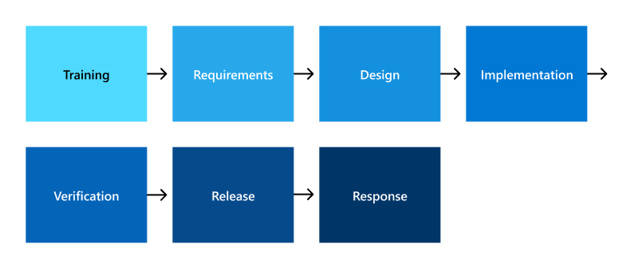

# Microsoft Security Development Lifecycle (SDL)

Security and privacy should never be an afterthought when developing secure software, a formal process must be in place to ensure they're considered at all points of the product's lifecycle. Microsoft's Security Development Lifecycle (SDL) embeds comprehensive security requirements, technology specific tooling, and mandatory processes into the development and operation of all software products. All development teams at Microsoft must adhere to the SDL processes and requirements, resulting in more secure software with fewer and less severe vulnerabilities at a reduced development cost.

Microsoft SDL consists of seven components including five core phases and two supporting security activities. The five core phases are requirements, design, implementation, verification, and release. Each of these phases contains mandatory checks and approvals to ensure all security and privacy requirements and best practices are properly addressed. The two supporting security activities, training and response, are conducted before and after the core phases respectively to ensure they're properly implemented, and software remains secure after deployment.

## Training

All Microsoft employees are required to complete general security awareness training and specific training appropriate to their role. Initial security awareness training is provided to new employees upon hire and annual refresher training is required throughout their employment at Microsoft.

Developers and engineers must also participate in role specific training to keep them informed on security basics and recent trends in secure development. All full-time employees, interns, contingent staff, subcontractors, and third parties are also encouraged and provided with the opportunity to seek advanced security and privacy training.

## Requirements

Every product, service, and feature Microsoft develops starts with clearly defined security and privacy requirements; they're the foundation of secure applications and inform their design. Development teams define these requirements based on factors such as the type of data the product will handle, known threats, best practices, regulations and industry requirements, and lessons learned from previous incidents. Once defined, the requirements are clearly defined, documented, and tracked.

Software development is a continuous process, meaning that the associated security and privacy requirements change throughout the product's lifecycle to reflect changes in functionality and the threat landscape.

## Design

Once the security, privacy, and functional requirements have been defined, the design of the software can begin. As a part of the design process, threat models are created to help identify, categorize, and rate potential threats according to risk. Threat models must be maintained and updated throughout the lifecycle of each product as changes are made to the software.

The threat modeling process begins by defining the different components of a product and how they interact with each other in key functional scenarios, such as authentication. Data Flow Diagrams (DFDs) are created to visually represent key data flow interactions, data types, ports, and protocols used. DFDs are used to identify and prioritize threats for mitigation that are added to the product's security requirements.

Developers are required to use Microsoft's Threat Modeling Tool for all threat models, which enables the team to:

- Communicate about the security design of their systems
- Analyze security designs for potential security issues using a proven methodology
- Suggest and manage mitigation for security issues

Before any product is released, all threat models are reviewed for accuracy and completeness, including mitigation for unacceptable risks.

## Implementation

Implementation begins with developers writing code according to the plan they created in the previous two phases. Microsoft provides developers with a suite of secure development tools to effectively implement all the security, privacy, and function requirements of the software they design. These tools include compilers, secure development environments, and built-in security checks.

## Verification

Before any written code can be released, several checks and approvals are required to verify that the code conforms to SDL, meets design requirements, and is free of coding errors. SDL requires that manual reviews are conducted by a reviewer separate from the personnel the developed the code. Separation of duties is an important control in this step to ensure no code can be written and released by the same person leading to potential accidental or malicious harm.

Various automated checks are also required and are built into the commit pipeline to analyze code during check-in and when builds are compiled. The security checks used at Microsoft fall into the following categories:

- **Static code analysis**: Analyzes source code for potential security flaws, including the presence of credentials in code.
- **Binary analysis**: Assesses vulnerabilities at the binary code level to confirm code is production ready.
- **Credential and secret scanner**: Identify possible instances of credential and secret exposure in source code and configuration files.
- **Encryption scanning**: Validates encryption best practices in source code and code execution.
- **Fuzz testing**: Use malformed and unexpected data to exercise APIs and parsers to check for vulnerabilities and validate error handling.
- **Configuration validation**: Analyzes the configuration of production systems against security standards and best practices.
- **Component Governance (CG)**: Open-source software detection and checking of version, vulnerability, and legal obligations.

If the manual reviewer or automated tools find any issues in the code, the submitter will be notified, and they're required to make the necessary changes before submitting it for review again.

Additionally, penetration tests are regularly conducted on Microsoft online services by both internal and external providers. Penetration tests provide another means for discovering security flaws not detected by other methods. To learn more about penetration testing at Microsoft, see [Attack simulation in Microsoft 365](/compliance/assurance/assurance-monitoring-and-testing).

## Release

After passing all required security tests and reviews, builds aren't immediately released to all customers. Builds are systematically and gradually released to larger and larger groups, referred to as rings, in what is called a safe deployment process (SDP). The SDP rings are defined as follows:

- **Ring 0**: The development team responsible for the service
- **Ring 1**: All Microsoft employees
- **Ring 2**: Users outside of Microsoft who have configured their organization or specific users to be on the targeted release channel
- **Ring 3**: Worldwide standard release in sub-phases

Builds remain in each of these rings for an appropriate number of days with high load periods, except for Ring 3 since the build has been appropriately tested for stability in the earlier rings.

## Response

All Microsoft services are extensively logged and monitored after release, identifying potential security incidents using a centralized proprietary near-real-time monitoring system. To learn more about security monitoring and security incident management at Microsoft, see [Security monitoring overview](/compliance/assurance/assurance-security-monitoring) and [Microsoft security incident management](/compliance/assurance/assurance-security-incident-management).
