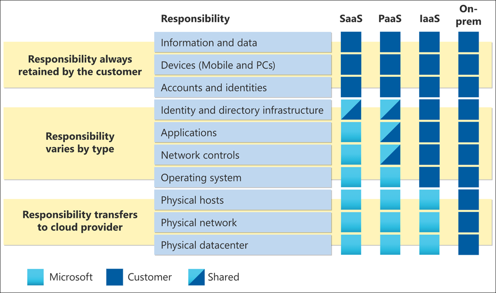

# Risk Assessment Guide for Microsoft Cloud

The goal of a cloud risk assessment is to ensure that the system and data considered for migration to the cloud don't introduce any new or unidentified risk into the organization. The focus is to ensure confidentiality, integrity, availability, and privacy of information processing and to keep identified risks below the accepted internal risk threshold.

In a shared responsibility model, the Cloud Service Provider (CSP) is responsible for managing security and compliance *of the cloud* as the provider. The customer remains responsible for managing and configuring security and compliance *in the cloud* in accordance with their needs and risk tolerance.

In this guide, best practices are shared on how to efficiently evaluate vendor risks and how to use the resources and tools Microsoft makes available.

## Understand shared responsibility in the cloud

Cloud deployments can be categorized as Infrastructure as a Service (IaaS), Platform as a Service (PaaS), or Software as a Service (SaaS). Depending upon the applicable cloud service model, the level of responsibility over the solutions' security controls shift between the CSP and the customer. In a traditional on-premises model, the customer is responsible for the whole stack. When moving to the cloud, all physical security responsibilities transfer to the CSP. Depending on the cloud service model for your organization, additional responsibilities shift over to the CSP. However, in most service models, your organization remains responsible for the devices used to access the cloud, network connectivity, your accounts and identities, and your data. Microsoft invests heavily in creating services that allow customers to stay in control of their data across the entire lifecycle.

Microsoft Cloud operates at a hyperscale, relying on a combination of DevSecOps and automation to standardize operating models. Microsoft operating model changes the way risk is approached compared to traditional on-premises operating models, leading to the implementation of different and sometimes unfamiliar controls to manage risks. When conducting your cloud risk assessment, keep in mind that Microsoft's goal is to ensure all risks are addressed, but not necessarily to implement the same controls your organization does. Microsoft may address the same risks with a different set of controls and that should be reflected in the cloud risk assessment. Designing and implementing strong preventive controls can reduce much of the work required by the detective and corrective controls. An example of this is Microsoft's implementation of [Zero Standing Access (ZSA)](assurance-microsoft-365-service-engineer-access-control.md).

## Adopt a framework

Microsoft recommends that customers map their internal risk and controls framework to an independent framework that addresses cloud risks in a standardized way. If your existing internal risk assessment models do not address the specific challenges that come with cloud computing, you will benefit from these broadly adopted and standardized frameworks. A secondary benefit is that Microsoft provides mappings against these frameworks in documentation and tools that will accelerate your risk assessments. Examples of these frameworks include the [ISO 27001 Information security standard](/compliance/regulatory/offering-iso-27001), [CIS Benchmark](/compliance/regulatory/offering-cis-benchmark), and [NIST SP 800-53](https://csrc.nist.gov/Projects/risk-management/sp800-53-controls/release-search#!/800-53). Microsoft offers the most comprehensive set of compliance offerings of any CSP. For more information, see [Microsoft compliance offerings](/compliance/regulatory/offering-home).

Use [Microsoft Compliance Manager](/microsoft-365/compliance/compliance-manager) to create your own assessments that evaluate compliance with the industry and regional regulations that apply to your organization. Assessments are built upon the framework of assessment templates, which contain the necessary controls, improvement actions, and where applicable, Microsoft actions for completing the assessment. For Microsoft actions, detailed implementation plans and recent audit results are provided. This way, time can be saved on fact finding, mapping, and researching how specific controls are implemented by Microsoft. For more information, see the Microsoft Compliance Manager article.

## Understand how Microsoft operates to safeguard your data

While the customer is responsible for managing and configuring security and compliance *in the cloud*, the CSP is responsible for managing security and compliance *of the cloud*. One way to validate that the CSP is effectively addressing their responsibilities and upholding their promises is to review their external audit reports such as ISO and SOC. Microsoft makes external audit reports available to authenticated audiences on the [Service Trust Portal](https://servicetrust.microsoft.com/ViewPage/MSComplianceGuideV3).

In addition to external audit reports, Microsoft highly encourages customers to take advantage of the following resources to help understand how Microsoft operates in depth:

- [On-demand Learning Path](/learn/roles/auditor): Microsoft's Learn platform offers hundreds of learning paths and modules on different topics. Amongst them, take [Learn how Microsoft safeguards customer data](/learn/paths/audit-safeguard-customer-data/) to understand Microsoft's fundamental security and privacy practices.

- [Service Assurance on Microsoft Compliance](/compliance/#service-assurance): Articles on Microsoft's practices are categorized into 16 domains for easier review. Each domain includes an overview that captures how Microsoft is managing risks associated with each area. Audit tables are provided containing links to the most recent reports stored on Service Trust Portal, related sections, and the date the audit report was conducted for Microsoft online services. If available, links to artifacts demonstrating control implementation, such as third-party vulnerability assessments and business continuity plan verification reports are provided. Like audit reports, these artifacts are hosted on STP and require authentication to access.

| **Domain** |**Description** |
|:---------- |:-------------- |
| [**Architecture**](assurance-architecture.md) | The design of Microsoft online services and the security principles that act as its foundation. |
| [**Audit logging**](assurance-audit-logging.md) | How Microsoft captures, processes, stores, and protects the logs that make security and performance monitoring possible. |
| [**Datacenter security**](assurance-datacenter-security.md) | How Microsoft securely operates the datacenters that provide the means to operate Microsoft online services worldwide. |
| [**Encryption and key management**](assurance-encryption.md) | The cryptographic protection of customer communications and the data stored and processed in the cloud. |
| [**Governance**](assurance-governance.md) | How Microsoft creates, distributes, updates, and enforces security policies throughout the enterprise to meet customer promises and compliance requirements. |
| [**Human resources**](assurance-human-resources.md) | The screening processes and secure management of personnel throughout their time at Microsoft. |
| [**Identity and access management**](assurance-identity-and-access-management.md) | The protection of Microsoft online services and customer data from unauthorized or malicious access. |
| [**Incident management**](assurance-incident-management.md) | The processes Microsoft uses to prepare for, detect, respond, and communicate all security and privacy incidents. |
| [**Network security**](assurance-network-security.md) | How Microsoft protects its network boundaries from external attacks and manages its internal network to limit their propagation. |
| [**Privacy**](assurance-privacy.md) | How Microsoft handles and protects customer data to preserve their data rights. |
| [**Resiliency and continuity**](assurance-resiliency-and-continuity.md) | Process and technologies used to maintain service availability and ensure business continuity and recovery. |
| [**Risk management**](assurance-risk-management.md) | The identification, assessment, and actions taken to minimize risk across the enterprise. |
| [**Security development and operation**](assurance-security-development-and-operation.md) | How Microsoft ensures that its services are designed, run, and managed securely throughout their lifecycle. |
| [**Security monitoring**](assurance-security-monitoring.md) | The central analysis of logs to detect and alert personnel of any unauthorized or malicious activity. |
| [**Supplier management**](assurance-supplier-management.md) | How Microsoft screens and manages third-party companies that assist with Microsoft online services. |
| [**Vulnerability management**](assurance-vulnerability-management.md) | The processes Microsoft uses to scan for, detect, and address vulnerabilities and malware. |

## Resources

- [Risk Assessment and Compliance Guide for Financial Institutions in the Microsoft Cloud](https://servicetrust.microsoft.com/ViewPage/TrustDocumentsV3?command=Download&downloadType=Document&downloadId=edee9b14-3661-4a16-ba83-c35caf672bd7&tab=7f51cb60-3d6c-11e9-b2af-7bb9f5d2d913&docTab=7f51cb60-3d6c-11e9-b2af-7bb9f5d2d913_FAQ_and_White_Papers)
- [Concentration Risk: Perspectives from Microsoft](https://azure.microsoft.com/mediahandler/files/resourcefiles/concentration-risk-perspectives-from-microsoft-/Concentration_Risk_Perspectives_092020.pdf)
- [Service Trust Portal](https://servicetrust.microsoft.com/)
