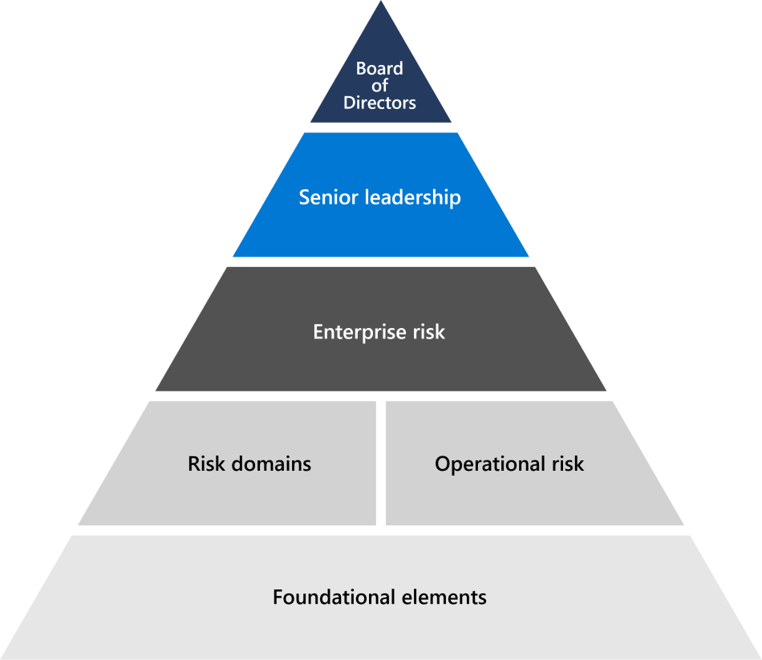

# Risk management overview

## How does Microsoft assess and manage risk across the enterprise?

Risk management is the process of identifying, assessing, and responding to threats or events that can impact Company or customer objectives. Risk management at Microsoft is designed to anticipate new threats and provide ongoing security for our cloud systems and the customers who use them.

Microsoft's risk management align to the Enterprise Risk Management (ERM) framework. ERM enables the overall enterprise risk management process and works with management across the enterprise to identify and ensure accountability for Microsoft's most significant risks.

Microsoft ERM enables common risk management principles across the enterprise so business units can independently facilitate consistent and comparative risk assessments. This coordination gives Microsoft the ability to aggregate and report risk information in a consolidated manner for management. ERM provides business units in Microsoft with common methodologies, tools, and goals for the risk management process. Microsoft 365 and other engineering groups and business units use these tools to conduct individual risk assessments as part of their own risk management programs under the guidance of ERM.

## How do Microsoft online services work with ERM?

Each online service follows ERM guidance to manage risks across Microsoft services. The program focuses on aligning the ERM framework with existing Microsoft engineering, service operations, and compliance processes, making the Risk Management program more effective and efficient. Each online service's risk management activities ultimately roll up into and inform the ERM process.

As part of risk assessment activities, each online service analyzes design and operating effectiveness of controls implemented as part of the Microsoft Controls Framework (Framework). The Framework is a rationalized set of controls that, when properly implemented along with supporting compliance activities, allows engineering teams to comply with key regulations and certifications.

## Related external regulations & certifications

Microsoft's online services are regularly audited for compliance with external regulations and certifications. Refer to the following table for validation of controls related to risk management.

### Azure and Dynamics 365

| **External audits** | **Section** | **Latest report date** |
|:--------------------|:------------|:-----------------------|
| [ISO 27001/27002](https://servicetrust.microsoft.com/ViewPage/MSComplianceGuideV3?command=Download&downloadType=Document&downloadId=e9116047-f327-430c-a83f-166b7e561ad6&tab=7027ead0-3d6b-11e9-b9e1-290b1eb4cdeb&docTab=7027ead0-3d6b-11e9-b9e1-290b1eb4cdeb_ISO_Reports)    [Statement of Applicability](https://servicetrust.microsoft.com/ViewPage/MSComplianceGuideV3?command=Download&downloadType=Document&downloadId=00af6c3e-7f3e-4e0d-8b0e-79f45ef2cef1&tab=7027ead0-3d6b-11e9-b9e1-290b1eb4cdeb&docTab=7027ead0-3d6b-11e9-b9e1-290b1eb4cdeb_ISO_Reports)   [Certification](https://servicetrust.microsoft.com/ViewPage/MSComplianceGuideV3?command=Download&downloadType=Document&downloadId=d7af5304-3a31-40e6-9abb-e26352305d41&tab=7027ead0-3d6b-11e9-b9e1-290b1eb4cdeb&docTab=7027ead0-3d6b-11e9-b9e1-290b1eb4cdeb_ISO_Reports) | A.5: Information security policies | December 2, 2020 |
| [ISO 27017](https://servicetrust.microsoft.com/ViewPage/MSComplianceGuideV3?command=Download&downloadType=Document&downloadId=e9116047-f327-430c-a83f-166b7e561ad6&tab=7027ead0-3d6b-11e9-b9e1-290b1eb4cdeb&docTab=7027ead0-3d6b-11e9-b9e1-290b1eb4cdeb_ISO_Reports)    [Statement of Applicability](https://servicetrust.microsoft.com/ViewPage/MSComplianceGuideV3?command=Download&downloadType=Document&downloadId=a3bca0ac-867d-4204-b66b-13665f5f1e8d&tab=7027ead0-3d6b-11e9-b9e1-290b1eb4cdeb&docTab=7027ead0-3d6b-11e9-b9e1-290b1eb4cdeb_ISO_Reports)   [Certification](https://servicetrust.microsoft.com/ViewPage/MSComplianceGuideV3?command=Download&downloadType=Document&downloadId=25718a8a-f34d-41e1-a95a-c49246508787&tab=7027ead0-3d6b-11e9-b9e1-290b1eb4cdeb&docTab=7027ead0-3d6b-11e9-b9e1-290b1eb4cdeb_ISO_Reports) | A.5: Information security policies | December 2, 2020 |
| [ISO 27018](https://servicetrust.microsoft.com/ViewPage/MSComplianceGuideV3?command=Download&downloadType=Document&downloadId=e9116047-f327-430c-a83f-166b7e561ad6&tab=7027ead0-3d6b-11e9-b9e1-290b1eb4cdeb&docTab=7027ead0-3d6b-11e9-b9e1-290b1eb4cdeb_ISO_Reports)    [Statement of Applicability](https://servicetrust.microsoft.com/ViewPage/MSComplianceGuideV3?command=Download&downloadType=Document&downloadId=00af6c3e-7f3e-4e0d-8b0e-79f45ef2cef1&tab=7027ead0-3d6b-11e9-b9e1-290b1eb4cdeb&docTab=7027ead0-3d6b-11e9-b9e1-290b1eb4cdeb_ISO_Reports)   [Certification](https://servicetrust.microsoft.com/ViewPage/MSComplianceGuideV3?command=Download&downloadType=Document&downloadId=56904fc3-0942-4ff5-9eef-7cabc751a25c&tab=7027ead0-3d6b-11e9-b9e1-290b1eb4cdeb&docTab=7027ead0-3d6b-11e9-b9e1-290b1eb4cdeb_ISO_Reports) | A.5: Information security policies | December 2, 2020 |
| [ISO 22301](https://servicetrust.microsoft.com/ViewPage/MSComplianceGuideV3?command=Download&downloadType=Document&downloadId=6d388547-fc88-46e3-8de2-6bc2edc08b06&tab=7027ead0-3d6b-11e9-b9e1-290b1eb4cdeb&docTab=7027ead0-3d6b-11e9-b9e1-290b1eb4cdeb_ISO_Reports)     [Certification](https://servicetrust.microsoft.com/ViewPage/MSComplianceGuideV3?command=Download&downloadType=Document&downloadId=ee4b611b-bb4d-4056-b189-00da36e88949&tab=7027ead0-3d6b-11e9-b9e1-290b1eb4cdeb&docTab=7027ead0-3d6b-11e9-b9e1-290b1eb4cdeb_ISO_Reports) | 6.1.1: Determining risks and opportunities   6.1.2: Addressing risks and opportunities | March 13, 2020 |
| [SOC 1](https://servicetrust.microsoft.com/ViewPage/MSComplianceGuideV3?command=Download&downloadType=Document&downloadId=b8721ebd-af20-42fe-b22f-8332b0a19517&tab=7027ead0-3d6b-11e9-b9e1-290b1eb4cdeb&docTab=7027ead0-3d6b-11e9-b9e1-290b1eb4cdeb_SOC_%2F_SSAE_16_Reports)   [SOC 2](https://servicetrust.microsoft.com/ViewPage/MSComplianceGuideV3?command=Download&downloadType=Document&downloadId=af02eb56-4261-416b-98e3-2e713e37a77e&tab=7027ead0-3d6b-11e9-b9e1-290b1eb4cdeb&docTab=7027ead0-3d6b-11e9-b9e1-290b1eb4cdeb_SOC_%2F_SSAE_16_Reports)   [SOC 3](https://servicetrust.microsoft.com/ViewPage/MSComplianceGuideV3?command=Download&downloadType=Document&downloadId=645b2f97-5bfd-4cea-b02c-c4bcda328a37&tab=7027ead0-3d6b-11e9-b9e1-290b1eb4cdeb&docTab=7027ead0-3d6b-11e9-b9e1-290b1eb4cdeb_SOC_%2F_SSAE_16_Reports) | SOC2-26: Annual risk assessment | March 31, 2021   November 12, 2021   November 12, 2021 |

### Office 365

| **External audits** | **Section** | **Latest report date** |
|:--------------------|:------------|:-----------------------|
| [FedRAMP](https://compliance.microsoft.com/compliancemanager) | CA-2: Security assessments   CA-5: Plan of action and milestones   RA-3: Risk assessment | September 24, 2020 |
| [ISO 27001/27002/27017](https://servicetrust.microsoft.com/ViewPage/MSComplianceGuideV3?command=Download&downloadType=Document&downloadId=08ce227f-d1d9-4c4c-b255-4f2e4ec8f941&tab=7027ead0-3d6b-11e9-b9e1-290b1eb4cdeb&docTab=7027ead0-3d6b-11e9-b9e1-290b1eb4cdeb_ISO_Reports)    [Statement of Applicability](https://servicetrust.microsoft.com/ViewPage/MSComplianceGuideV3?command=Download&downloadType=Document&downloadId=c0df4ce8-c77e-4183-84eb-c8688470d8b1&tab=7027ead0-3d6b-11e9-b9e1-290b1eb4cdeb&docTab=7027ead0-3d6b-11e9-b9e1-290b1eb4cdeb_ISO_Reports)   [Certification (27001/27002)](https://servicetrust.microsoft.com/ViewPage/MSComplianceGuideV3?command=Download&downloadType=Document&downloadId=1e84a14a-2468-45ac-9412-5e53250d57ec&tab=7027ead0-3d6b-11e9-b9e1-290b1eb4cdeb&docTab=7027ead0-3d6b-11e9-b9e1-290b1eb4cdeb_ISO_Reports)   [Certification (27017)](https://servicetrust.microsoft.com/ViewPage/MSComplianceGuideV3?command=Download&downloadType=Document&downloadId=70de0999-5451-43a3-9ef4-761e8fbfb1a3&tab=7027ead0-3d6b-11e9-b9e1-290b1eb4cdeb&docTab=7027ead0-3d6b-11e9-b9e1-290b1eb4cdeb_ISO_Reports) | A.5: Information security policies | March, 2021 |
| [SOC 1](https://servicetrust.microsoft.com/ViewPage/MSComplianceGuideV3?command=Download&downloadType=Document&downloadId=90df3f9c-3aaf-4dbf-99d0-ca9f2991721b&tab=7027ead0-3d6b-11e9-b9e1-290b1eb4cdeb&docTab=7027ead0-3d6b-11e9-b9e1-290b1eb4cdeb_SOC_%2F_SSAE_16_Reports) | CA-03: Risk management | December 24, 2020 |
| [SOC 2](https://servicetrust.microsoft.com/ViewPage/MSComplianceGuideV3?command=Download&downloadType=Document&downloadId=a73c1738-7892-42b7-acd3-87b6371c53f6&tab=7027ead0-3d6b-11e9-b9e1-290b1eb4cdeb&docTab=7027ead0-3d6b-11e9-b9e1-290b1eb4cdeb_SOC_%2F_SSAE_16_Reports) | CA-02: Governance, risk, and compliance team responsibilities   CA-03: Risk management   CA-17: Microsoft security policy   CA-24: Internal risk assessment | December 24, 2020 |
