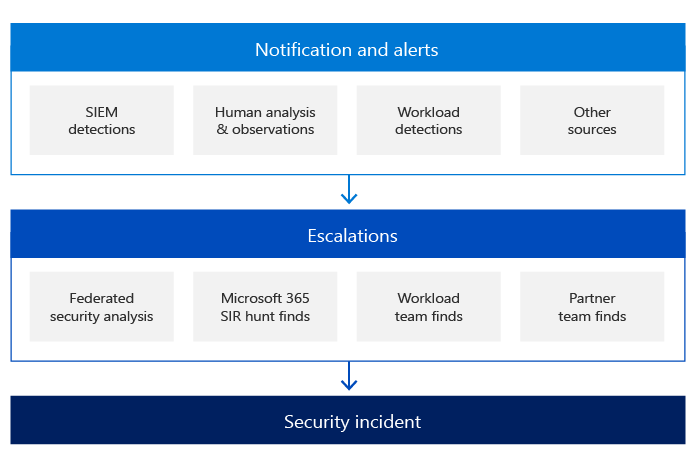

# Microsoft security incident management: Detection and analysis

To detect malicious activity, each of Microsoft's online services centrally logs security events and other data and perform various analytical techniques to find anomalous or suspicious activity. Log files are collected from Microsoft online services servers and infrastructure devices and stored in central and consolidated databases.

Microsoft takes a risk-based approach to detecting malicious activity. We use incident data and threat intelligence to define and prioritize our detections.

Employing a team of highly experienced, proficient, and skilled people is one of the most important pillars to success in the detection and analysis phase. Microsoft employs multiple service teams that include employees with competencies on all components within the stack, including the network, routers, firewalls, load balancers, operating systems, and applications.

The security detection mechanisms in Microsoft online services also include notifications and alerts that are initiated by different sources. Microsoft online services security response teams are the key orchestrators of the security incident escalation process. These teams receive all escalations and are responsible for analyzing and confirming the validity of the security incident.

One of the primary pillars of detection is notification:

- Each service team is responsible to log any action or event inside the service based on the requirements from the online service security team. All logs created by the different service teams are processed by a Security Information and Event Management (SIEM) solution with predefined security and detection rules. These rules evolve based on security team recommendations, on information learned from previous security incidents, to determine if there is any suspicious or malicious activity.
- If a customer determines that a security incident is underway, they may open a support case with Microsoft, which is assigned to the Microsoft communications team and turned into an escalation to all appropriate teams.

Azure, Dynamics 365, and Microsoft 365 service teams also use the intelligence gained in trend analysis through security monitoring and logging to detect abnormalities in Microsoft online services information systems that might indicate an attack or a security incident. Microsoft online services systems aggregate output from these logs in the production environment into centralized logging servers. From these centralized logging servers, logs are examined to spot trends throughout the production environment. Data aggregated in the centralized servers are securely transmitted into a logging service for advanced querying, dashboard building and detecting anomalous and malicious activity. The service also uses machine learning to detect anomalies with log output.

During the escalation phase and depending on the nature of the security incident, security response teams may engage one or more subject matter experts from various teams at Microsoft:

- Online Services Security and Compliance team
- Microsoft Threat Intelligence Center (MSTIC)
- Microsoft Security Response Center (MSRC)
- Corporate, External, and Legal Affairs (CELA)
- Azure Security
- Microsoft 365 engineering, and others.

Before an escalation to any security response team occurs, the service team is responsible for determining and setting the severity level of the security incident based on defined criteria such as:

- Privacy
- Impact
- Scope
- Number of affected tenants
- Region
- Service
- Details of the incident
- Specific customer industry or market regulations.

Incident prioritization is determined by using distinct factors, including but not limited to the functional impact of the incident, the informational impact of the incident, and the recoverability from the incident.

After receiving an escalation about a security incident, the security team organizes a virtual team (v-team) comprised of members from the Microsoft online service security response team, service teams, and the incident communication team. The v-team must then confirm the legitimacy of the security incident and eliminate any false positives. The accuracy of information provided by the indicators determined during the preparation phase is critical. By analyzing this information by category of vector attack, the v-team can determine if the security incident is a legitimate concern.

At the beginning of the investigation, the security incident response team records all information about the incident according to our case management policies. As the case progresses, we track ongoing actions and follow evidence handling standards for gathering, retaining, and securing this data throughout the incident lifecycle.

Some examples of these actions would include:

- A summary, which is a brief description of the incident and its potential impact
- The incident's severity and priority, which are derived by assessing the potential impact
- A list of all indicators identified which led to detection of the incident
- A list of any related incidents
- A list of all actions taken by the v-team
- Any gathered evidence, which will also be preserved for post-mortem analysis and future forensic investigations
- Recommended next steps and actions

After security incident confirmation, the primary goals of the security response team and the appropriate service team are to contain the attack, to protect the service(s) under attack, and to avoid a greater global impact. At the same time, the appropriate engineering teams work to determine the root cause and to prepare the first recovery plan.

In the next phase, the security response team identifies the customer(s) affected by the security incident, if any. The scope of effect can take some time to determine, based on region, datacenter, service, server farm, server, and so forth. The list of affected customers is compiled by the service team and the corresponding Microsoft communications team, who then handle the customer notification process within contractual and compliance obligations.

## Related articles

- [Microsoft security incident management](assurance-security-incident-management.md)
- [Microsoft security incident management: Preparation](assurance-sim-preparation.md)
- [Microsoft security incident management: Containment, eradication, and recovery](assurance-sim-containment-eradication-recovery.md)
- [Microsoft security incident management: Post-incident activity](assurance-sim-post-incident-activity.md)
- [How to Log a Security Event Support Ticket](/azure/security/fundamentals/event-support-ticket)
- [Azure and Dynamics 365 breach notification under the GDPR](/compliance/regulatory/gdpr-breach-azure-dynamics)
